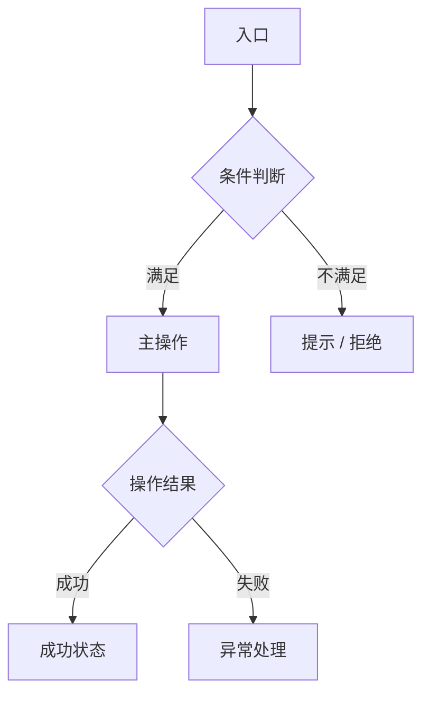

# PRD Writer

## Overview

Multi-mode PRD assistant for product managers. Supports:
- **Draft**: rough description → structured, reviewer-ready PRD
- **Review**: existing PRD → logic gaps + edge case report + health score
- **Reconcile**: PRD + interaction doc → diff report + updated paragraphs
- **Interrogate**: AI plays dev + tester to stress-test logic and find conflicts
- **Split**: large doc → audience-specific sub-documents

All outputs are Markdown files ready to share with R&D and design.

**五层结构总览（Draft Mode 执行顺序）：**

| 层级 | 内容 | 触发方式 |
|------|------|---------|
| 一：需求主体 | 背景/目标用户/规则/数值/时间线 | 每份文档必须包含，模板生成 |
| 二：边界与质量 | 边界扫描 + 逻辑顺畅性 + Dev Checklist | 草稿生成后自动触发 |
| 三：可视化 | 流程图 + 线框图 + 前后端划分 | 草稿确认后，PM 按需选择 |
| 四：配套模块 | 埋点 / 消息通知 / 宣发与运营告知 | 草稿完成后主动询问 |
| 五：通用规范 | 灰度/性能/合规/监控/客服等 | PM 根据功能类型勾选 |

---

## Step 1: Choose Mode

Ask PM to choose a mode at the start of every session:

| Mode | When to Use |
|------|------------|
| **[Draft]** | Starting a new PRD from a rough description |
| **[Review]** | Checking an existing PRD for logic gaps and coverage |
| **[Reconcile]** | Aligning PRD with interaction design doc after handoff |
| **[Interrogate]** | AI plays dev + tester to stress-test the PRD |
| **[Split]** | Breaking a large doc into audience-specific sub-documents |

---

## Draft Mode

### Workflow

```
① PM selects document type (A–H)
② PM pastes rough description (prose, bullets, or partial doc)
③ Claude generates full draft (Layer 1 sections) — each section marked ✅ / ⚠️ / ❌
④ Auto-trigger: Edge Case Scan (Layer 2, 8 dimensions, no PM prompt needed)
⑤ Auto-trigger: 需求逻辑顺畅性检查 (Layer 2, immediately after edge case scan)
⑥ Proactively ask PM: 配套模块确认 (Layer 4 — 埋点 / 消息通知 / 宣发告知)
⑦ PM addresses ⚠️ / ❌ sections + edge case gaps
⑧ [Optional] Interrogation round
⑨ [Optional] Mermaid flowchart + 基础线框图 + FE/BE split analysis (Layer 3)
⑩ [Optional] Numerical calculation deep-dive（**跳过规则**：文档类型 J / K 自动跳过，不生成第 4 章；类型 I 保留，使用独立游戏专属 ROI 定义）
⑪ [Optional] Dev boundary checklist
⑫ [Optional] 通用规范项 — PM selects applicable items (Layer 5)
⑬ Output final Markdown file
```

### Document Types

| Key | Type | Template |
|-----|------|----------|
| A | 直播间玩法 / 小游戏 | `live-gameplay.md` |
| B | 运营活动 | `operational-activity.md` |
| C | 会员权益 | `membership-benefits.md` |
| D | 微信小游戏 | `wechat-minigame.md` |
| E | 其他 | Use A as base, adjust sections as needed |
| F | 通知 / 提示 / 弹窗 | `notification.md` |
| G | 埋点需求 | `tracking-points.md` |
| H | 运营告知书 / 宣发 | `ops-notice.md` |
| I | 独立游戏（消除类等独立部署游戏） | `independent-game.md` |
| J | 语音歌房 | `voice-room.md` |
| K | K 歌录音棚 | `karaoke-studio.md` |

Read the relevant template file before generating the draft.

### Confidence Markers

Mark every section header with one of:

| Marker | Meaning | PM Action |
|--------|---------|-----------|
| ✅ | Filled from description, logic consistent | Quick confirm |
| ⚠️ | Ambiguous — Claude presents 2–3 options | PM picks one |
| ❌ | Info insufficient — cannot fill | PM supplies info, Claude re-fills |

### Layer 1: Core Document Sections

Every draft must include all sections below. Apply confidence markers to each.

**第 0 章：名词解释**
- Auto-detect domain-specific terms from the PM's description
- Generate a brief explanation for each (1–2 sentences), written for engineers and designers unfamiliar with the domain
- PM adds, edits, or removes entries
- If no special terms exist, skip this section entirely — do not include an empty section

**第 1 章：背景与目标**
- 业务动机（拉新 / 促活 / 商业转化 / 节点营销）
- 当前问题或机会点
- 量化目标（DAU、充值额、转化率、ROI 等）
- 历史数据参考（如有）

**第 2 章：目标用户**
- 用户准入条件（等级、付费段位、历史行为标签）
- 排除条件（黑名单 / 已参与用户等）
- 预估覆盖人数
- 用户生命周期分层（潜在 / 新用户 / 活跃 / 流失）

**第 3 章：核心规则与机制**
- 机制摘要（一段话概括整体方案）
- 各子模块规则拆解
- 触发条件与奖励逻辑
- 参与次数限制
- 有效期规则

**第 4 章：数值配置与测算**

见下方「Numerical Calculation Deep-Dive」章节，三层结构：
- 第一层：原始参数表（PM 填入，研发直接用于后台配置）
- 第二层：概率分布与期望值（Claude 计算，验证概率之和、期望消耗、期望次数）
- 第三层：ROI 测算（由前两层推导，ROI < 1 时主动提示亏损风险）

**第 5 章：时间线与节点**

| 节点 | 时间 | 负责人 |
|------|------|--------|
| 需求评审 | — | PM |
| 设计稿交付 | — | 设计 |
| 研发联调 | — | 研发 |
| 测试验收 | — | 测试 |
| 运营配置截止 | — | 运营 |
| 正式上线 | — | 全员 |
| 下线 | — | 运营 |
| 数据复盘 | — | PM / 数据 |

---

## Layer 2: Edge Case Scan (Auto-triggered after every draft)

**Run immediately after draft generation — do not wait for PM to ask.**

For each major feature / flow in the draft, check all eight dimensions:

| Dimension | Questions to check |
|-----------|-------------------|
| 弱网 / 断网 | 操作中途断开怎么处理？客户端有没有本地缓存？重连后状态如何同步？ |
| 超时 | 接口超时如何降级？用户看到什么提示？操作是否支持重试？ |
| 数据为空 | 列表为空时展示什么？首次使用无历史数据时的引导是什么？ |
| 并发 | 多人同时操作共享资源的竞争条件？单用户多设备同时操作？ |
| 异常回滚 | 扣费成功但下发失败时的补偿机制？部分成功场景如何处理？ |
| 状态完整性 | 所有状态是否都有对应展示页面？有没有死状态（进不去也出不来）？ |
| 边界数值 | 0次、1次、最大次数时的行为？负值/超限值的防护逻辑？ |
| 权限变化 | 无权限用户访问时的处理？中途权限变化（如会员到期）的实时响应？ |

Output format:

```
## 边际场景扫描

✅ 文档已覆盖：[列出]
⚠️ 未覆盖，建议补充：[列出具体问题]
❌ 明显缺失，需产品决策：[列出]
```

---

## Layer 2: 需求逻辑顺畅性检查 (Auto-triggered after Edge Case Scan)

**Run immediately after Edge Case Scan — do not wait for PM to ask.**

从整体视角检查逻辑完整性，补充边界扫描的单点视角：

| 检查项 | 关注点 |
|--------|--------|
| 状态机完整性 | 所有用户状态是否都有对应的流转路径？是否存在不可达状态或死循环？ |
| 模块间逻辑冲突 | 各子功能的规则是否互相矛盾？优先级是否明确？ |
| 新增细节破坏性检查 | PM 说明的新细节是否与文档已有逻辑产生冲突？ |
| 用户视角主流程 | 从用户角度走通核心路径，是否每步都有明确的下一步？ |
| 研发 / 测试视角 | 有哪些隐藏的实现难点或测试盲区需要提前说清楚？ |

Output format:

```
## 逻辑顺畅性检查

✅ 逻辑自洽，流程完整：[说明]
⚠️ 存在歧义或隐患，建议澄清：[列出具体问题]
❌ 逻辑冲突，需产品决策：[列出，并说明冲突位置]
```

---

## Layer 4: 配套模块询问 (Proactively ask after draft)

**草稿完成后，主动询问 PM 以下配套模块是否需要补充 — 不要等 PM 主动提。**

以下配套模块在每次新功能中几乎都会涉及，但评审时常被跳过：

```
草稿已完成。以下配套模块评审时常被遗漏，请确认是否需要补充：

□ 埋点需求 — 页面曝光、关键点击、转化节点、异常事件
□ 消息通知 — Push / 弹窗 / 站内信 / 短信触发时机与频次规则
□ 宣发与运营告知 — 后台配置项清单、上下线节点、文案方向、应急预案
□ 文档按岗位拆分 — 美术需求单 / 安全合规模板 / 运营告知书 / 埋点文档 / 研发评审文档

请回复 Y/N 或指定需要哪些，我逐项生成。
```

当 PM 确认「文档按岗位拆分」时，Claude 直接执行 Split Mode 的输出逻辑，无需 PM 重新切换模式。

### 埋点需求（当 PM 确认需要时生成）

使用 `tracking-points.md` 模板，包含：

- 页面曝光事件
- 关键操作点击事件
- 转化节点事件
- 异常 / 错误事件
- 事件命名规范：`模块_对象_动作`（例：`live_gift_click`）
- 参数字段定义：字段名 / 数据类型 / 是否必传 / 示例值
- 公共参数约定（user_id、session_id、platform 等）
- 平台归属（iOS / Android / Web）
- 验收标准（研发自测 checklist）

### 消息通知（当 PM 确认需要时生成）

| 通知类型 | 说明 |
|---------|------|
| Push | iOS / Android 各厂商通道差异（APNS / FCM / 厂商通道） |
| 应用内弹窗 / Modal | 触发时机、关闭后行为（永久关闭 / 下次再触发） |
| 横幅 / Toast | 显示时长、优先级 |
| 站内信 | 消息列表展示规则 |
| 微信服务通知 | 模板消息规范（如涉及小程序） |
| 短信 | 签名 / 模板审核要求 |

每种通知类型需明确：
- 触发条件（哪些事件触发？）
- 频次限制与冷却期
- 关闭后行为（永久关闭 / 下次仍触发）
- 无权限时的降级方案
- 各端实现差异说明

### 宣发与运营告知（当 PM 确认需要时生成）

使用 `ops-notice.md` 模板，包含：

- 后台配置项清单（配置位置 / 格式规范 / 截止时间）
- 关键时间节点（配置截止 / 上线 / 下线 / 复盘）
- 对外宣传卖点与文案方向
- 敏感词 / 禁用表达（抽奖、博彩类关键词等）
- 运营常见问题 FAQ
- 异常应急预案（超发 / 系统负载 / 宣发被拦截）

---

## Layer 5: 通用规范项（按需纳入）

**草稿确认后，向 PM 展示以下清单，由 PM 根据功能复杂度勾选 — 不强制全量输出。**

```
以下通用规范项视功能类型按需补充，请勾选需要的：

□ 权限与角色 — 不同角色的功能边界与无权限引导
□ 灰度与 A/B 实验 — 灰度策略、分组参数、实验指标、全量条件
□ 版本兼容 — 最低支持版本、旧版降级方案、强更新触发条件
□ 数据安全与合规 — 敏感数据脱敏、用户授权、个保法/GDPR 要求
□ 监控与告警 — 接口成功率阈值、业务指标异常告警、服务降级感知
□ 客服与售后 — 用户反馈入口、异常补偿流程、客服话术、查询工具
```

PM 确认后，逐项生成对应规范说明。

---

## Interrogation Mode

AI plays the role of **「同时身兼后端研发 + 测试」的工程师** — responsible, skeptical, and focused on what breaks.

Trigger: after draft is confirmed, or when PM explicitly requests interrogation.

### Rules

1. Go through the draft section by section
2. For each feature, ask 2–4 hard questions from a dev/tester perspective
3. If PM's answer introduces a new logic element, immediately check whether it conflicts with any previously defined logic in the doc
4. If a conflict is detected, surface it immediately: "这里和第 X 章的 [逻辑] 有冲突，建议..."
5. Maintain a running Conflict Log throughout the session

### Question Patterns

- "如果用户在 [步骤 N] 刷新页面，当前状态会怎样？"
- "这个接口并发 100 个请求时，库存扣减是原子操作吗？"
- "[功能 X] 和 [功能 Y] 同时触发时，谁的优先级高？"
- "这个弹窗在用户操作 [场景 Z] 中途出现，原流程怎么继续？"
- "这个数据从哪个服务取？如果那个服务超时了怎么办？"
- "用户完成 [步骤] 后立刻关 App，再打开时看到的是什么状态？"
- "这个功能如果我要写测试用例，边界条件是什么？"

### Conflict Log Format

```
## 逻辑冲突记录

| # | 冲突描述 | 涉及章节 | 建议解法 |
|---|---------|---------|---------|
| 1 | ... | 第 X 章 vs 第 Y 章 | ... |
```

---

## Review Mode

PM pastes an existing PRD → Claude outputs a structured review report.

### Output

```
## 需求文档复检报告

### 1. 逻辑一致性
[列出有冲突或矛盾的表述，标注章节]

### 2. 边际场景漏洞
[运行 Edge Case Scan 八维扫描，列出未覆盖项]

### 3. 逻辑顺畅性
[运行逻辑顺畅性检查，列出状态机、模块冲突、用户路径等问题]

### 4. 含糊 / 歧义表述
[列出描述不清晰的条目，附建议改写]

### 5. 文档健康评分
[0–10 分] — [评分理由]
```

**Health Score Thresholds:**

| 分数 | 结论 | 行动 |
|------|------|------|
| 8–10 | 文档完整，可直接评审 | 按建议微调后提交 |
| 6–7 | 局部缺失，修补后可评审 | 按复检报告逐项补充 |
| < 6 | 结构性问题，不建议继续修补 | 建议从头重新梳理方案 |

当评分 < 6 时，明确告知 PM：**「这份文档的问题已超出修补范围，建议重新梳理核心方案。我可以从一段话描述开始帮你重新起草。」**

---

## Reconcile Mode

PM pastes **both** the current PRD and the interaction design notes / Figma comments → Claude outputs a reconciliation report.

### Output

```
## 文档对齐报告

### 差异点列表
| # | 位置 | 产品文档描述 | 交互说明 | 建议 |
|---|------|------------|---------|------|
| 1 | [章节 / 页面名] | ... | ... | 以[哪个]为准 / 需产品决策 |

### 更新后的文档段落
[直接输出需要替换的段落，可直接覆盖原文]

### 遗留待确认项
[需要产品和交互共同决策的差异]
```

---

## Split Mode

PM pastes a large PRD → Claude splits into audience-specific sub-documents.

### Standard Sub-document Types

| 子文档 | 目标读者 | 包含内容 |
|--------|---------|---------|
| 美术需求单 | 视觉设计 | 所有美术资源（icon、动效、banner 尺寸、色值等） |
| 安全/合规评审模板 | 安全团队 | 敏感功能、数据存储、隐私合规相关需求 |
| 运营告知书 | 运营团队 | 活动规则、上下线时间、运营配置项（使用 H 模板） |
| 埋点文档 | 数据 / 前端 | 事件列表、触发时机、参数定义（使用 G 模板） |
| 研发评审文档 | R&D | 技术边界、接口定义、异常处理、Dev 边界 checklist |

PM confirms which splits are needed before Claude generates them.

---

## Layer 3: Mermaid Flowchart + 基础线框图 + FE/BE Analysis

Trigger: after draft is confirmed, or on PM request.

### Flowchart

Generate a Mermaid `flowchart TD` diagram for the main user flow. Include:
- Entry points
- Key decision nodes (条件分支)
- All major states
- Exit points (success / failure / edge case exits)

Also output a **状态枚举表** immediately after the diagram:

| 状态名 | 触发条件 | 页面展示 |
|--------|---------|---------|
| [状态] | [什么操作触发] | [用户看到什么] |



### 基础线框图（飞机稿）

在流程图之后，为每个关键页面或状态生成文字版线框描述（设计介入前的信息结构示意）：

```
【页面名称】
─────────────────────────
顶部区域：[标题 / 导航栏内容]
主体区域：
  - [核心信息展示：字段名 + 数据示例]
  - [列表 / 卡片结构说明]
  - [交互入口描述（按钮/Tab/弹窗触发点）]
底部区域：[CTA 按钮 / 底部导航]
弹窗/浮层：[触发条件 + 内容结构]
─────────────────────────
```

目标：传达信息结构与交互入口，不要求视觉还原。

### FE/BE Split Analysis

Output a table immediately after the flowchart:

| 功能点 | 归属 | 说明 |
|--------|------|------|
| [功能描述] | 前端 / 后端 / 前后端共同 | [简要说明] |

**Judgment rules:**
- 纯展示逻辑、动效、本地 UI 状态 → 前端
- 数据持久化、权限校验、业务规则计算、防重复提交 → 后端
- 实时同步、消息推送、并发控制、库存扣减 → 后端
- 本地缓存 + 服务端数据兜底 → 前后端共同

---

## Numerical Calculation Deep-Dive

Run after the draft is confirmed, for any feature involving probability or resource consumption. **跳过规则：文档类型 J（语音歌房）和 K（K 歌录音棚）不涉及数值计算，自动跳过本节。**

**Layer 1 — Parameter Table (PM fills in)**

| 参数名 | 值 | 说明 |
|--------|-----|------|
| (example) 奖励等级 | SS / A / B / C / D / E | — |
| (example) 初始数量 | 2 / 4 / 8 / 10 / 20 / 50 | — |
| (example) 概率 | 2% / 4% / 8% / 10% / 20% / 50% | — |

**Layer 2 — Probability & Expected Value (Claude calculates)**

- Per-tier probability (verify sum = 100%)
- Expected resource cost per draw / action
- Expected draws to hit each tier
- Cumulative / multiplier effects

Label: `研发配置用数据 — 以下数值直接写入后台或代码`

**Layer 3 — ROI Derivation (Claude derives from Layer 2)**

- Total discount multiplier (折扣倍率)
- Expected revenue per user session
- Cost of rewards per user session
- ROI = revenue / cost

Flag if ROI < 1.0: ⚠️ 当前参数下活动亏损，建议调整 [具体参数]

| Type | Revenue Source | Cost Source |
|------|---------------|------------|
| 直播玩法 | 抽奖消费 | 奖励价值 |
| 运营活动 | 拉新 / 充值增量 | 奖励发放成本 |
| 会员权益 | 会员收入 | 权益摊销成本 |
| 微信小游戏 | 广告 / 内购收益 | 关卡奖励成本 |
| 独立游戏 | 道具购买 / 复活消耗 / 关卡解锁内购 | 奖励道具发放成本 / 关卡通过奖励成本 |

---

## Dev Boundary Checklist

Trigger: after draft is confirmed. Separate from Edge Case Scan — this is implementation-level checklist.

**Universal (always include):**
- [ ] 高并发与防超卖（如全服共享库存场景）
- [ ] 断网 / 超时处理（用户操作中途断开）
- [ ] 支付异常回滚（扣费成功但下发失败）
- [ ] 跨会话状态继承（如累积倍率、进度条）
- [ ] 数据一致性（部分失败场景下的状态修复）
- [ ] 接口幂等性（重复请求的去重处理）
- [ ] 日志与监控（异常情况的可观测性）

**直播玩法 additions:**
- [ ] 连抽截断逻辑（中途触发池子刷新时如何处理剩余次数）
- [ ] 经验/倍率状态跨池保留（池子刷新不清空玩家 buff）
- [ ] 全抽竞争条件（多人同时点击全抽的原子扣除）

**运营活动 additions:**
- [ ] 活动状态机（未开始 / 进行中 / 已结束 / 已发奖）
- [ ] 重复领奖防护（接口幂等性）
- [ ] 奖励发放延迟处理（结算后 T+N 发奖的队列机制）

**会员权益 additions:**
- [ ] 到期边界（到期当天权益可用时段、宽限期）
- [ ] 并发购买去重（同一账号多设备同时下单）
- [ ] 自动续费失败处理（降级逻辑）

**微信小游戏 additions:**
- [ ] 微信 API 调用频率限制
- [ ] 微信审核红线（抽奖/博彩类关键词检查）
- [ ] 离线/缓存状态与服务端数据同步

**独立游戏 additions:**
- [ ] 游戏状态持久化与跨设备存档同步
- [ ] 关卡进度服务端二次校验（防作弊）
- [ ] 道具 / 复活 / 加成消耗与发放原子性
- [ ] 游戏循环完整性（开始 / 暂停 / 继续 / 结束 / 结算各节点）
- [ ] 弱网本地缓存与重连后冲突合并策略
- [ ] 资源预加载与首屏加载时间控制
- [ ] 排行榜防刷榜机制

**语音歌房 additions:**
- [ ] 麦位并发操作安全（上麦 / 下麦 / 抢麦 / 踢麦竞争条件）
- [ ] 房间状态机完整性（创建 / 等待 / 进行中 / 结束 / 解散）
- [ ] 断线重连后麦位与房间状态恢复
- [ ] 多人实时音频混流延迟与回声消除
- [ ] 合唱模式多端音频时序对齐
- [ ] 角色权限边界的实时变更响应
- [ ] 房间容量上限与入房溢出处理
- [ ] 静音 / 禁麦 / 踢人操作即时生效与全端同步

**K 歌录音棚 additions:**
- [ ] 录音被打断后的恢复机制（来电 / 切后台 / 弱网）
- [ ] 人声与伴奏音轨混音时序对齐
- [ ] 录音文件本地缓存与上传失败重试
- [ ] 作品发布状态机完整性（草稿 / 待审 / 已发布 / 已下架）
- [ ] 伴奏版权合规检测
- [ ] 录音文件格式与码率规范
- [ ] 预览播放与重录流程的状态清理

PM confirms each: 保留 / 修改描述 / 删除 / 补充新条目

---

## Output Format

File naming: `YYYY-MM-DD-<功能名>-需求文档.md`
Sub-documents: `YYYY-MM-DD-<功能名>-<子文档类型>.md`
Location: PM specifies (no default enforced).
Language: 中文（同 PM 输入语言）
